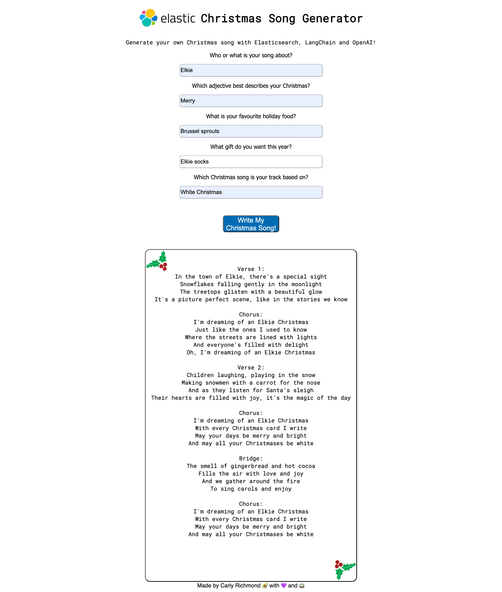
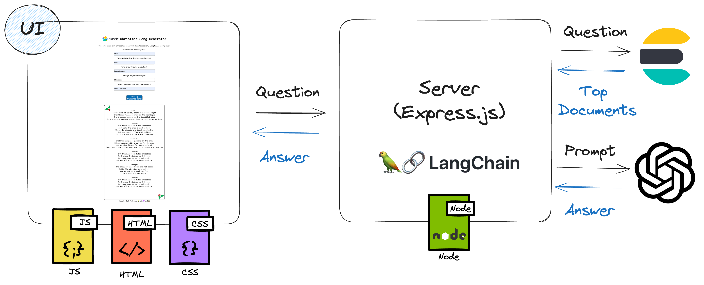

# Elasticsearch OpenAI Christmas Song Generator

## Overview

This project contains an example Christmas Song generator leveraging Elasticsearch and LangChain with the OpenAI LLM. This sample forms the basis of the [24th December entry of the 2023 Elastic Advent Calendar](https://discuss.elastic.co/t/dec-24th-2023-en-generating-the-ultimate-christmas-song-with-elasticsearch-and-llms/347313).



## Architecture

As shown in the below diagram, this is a simple 3-tier web application:



It comprises of: 

1. A simple framework independent HTML, JavaScript and CSS UI (`index.html|js|css`). 
2. Node.js Express server (`server/server.js`) with utilities for communication between Elasticsearch and OpenAI LLM using LangChain.
3. Elasticsearch data store, containing song lyrics from [http://www.christmassongs.net/song-lyrics](http://www.christmassongs.net/song-lyrics).

## How to run

### Prerequisites

Initiating the connection between the Express server and Elasticsearch requires the below environment variables to be defined, alongside an [API key and account for OpenAI](https://help.openai.com/en/articles/4936850-where-do-i-find-my-secret-api-key) to use with LangChain. These can be defined by exporting environment variables:

```
export ELASTIC_CLOUD_ID=my-elastic-deployment-cloud-id
export ELASTIC_API_KEY=my-api-key
export OPENAI_API_KEY=my-open-ai-key
```

Alternatively, they can be defined by including your own .envrc file at the top of the project if using a tool such as [`direnv`](https://direnv.net/).

### Running

The server, accessible at `http://localhost:3000/`, can be started using the below command:

```bash
npm install
node server/server.js
```

The application can be accessed by navigating to `http://localhost:3000/` in your preferred browser.

## Resources

Check out the relevant resources used in this project:

1. [Elasticsearch](https://www.elastic.co/guide/en/elasticsearch/reference/current/index.html)
2. [Elasticsearch JavaScript client](https://www.elastic.co/guide/en/elasticsearch/client/javascript-api/current/index.html)
3. [ChatGPT and Elasticsearch: OpenAI meets private data | Elasticsearch Labs](https://www.elastic.co/search-labs/chatgpt-elasticsearch-openai-meets-private-data)
4. [OpenAI Chat Completion API](https://platform.openai.com/docs/api-reference/chat/create)
5. [Express](https://expressjs.com/)